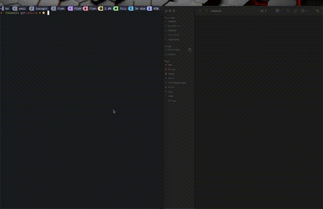
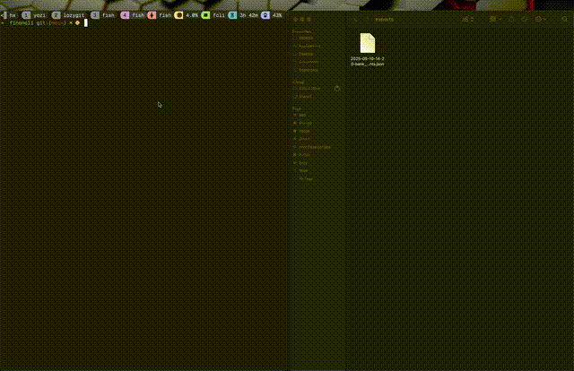

# FinanCLI

This is my first personal project as part of the [Boot.dev](https://boot.dev) curriculum, following completion of the Python path. I decided to build this project as it's something I currently already do using Microsoft Excel, and since I prefer to live in my terminal, I wanted something I could use without having to leave, or worse, grab my mouse.

**FinanCLI** is a command-line financial management tool designed to help you track, manage, and visualise your accounts and transactions — all from your terminal.

It aims to be:

- A personal finance tracker
- A CLI-based budgeting and reporting tool
- A full-featured interface for managing accounts and transactions

## Demo






---

## Features

- Open, close, deposit, and withdraw from accounts
- Internal transfers between accounts
- SQLite-backed data persistence
- Validation and error handling with helpful messages
- Modular controller and model architecture
- Support for various account types:
  - Bank Accounts
  - Credit Cards
  - Store Cards
  - Loans
  - Bills
  - Subscriptions
- CLI entry point with command routing
- PDF reports and CSV export
- Budgeting tools and financial summaries
- Tables using `tabulate`

---

## Requirements

- Python 3.10+
- `sqlite3` (standard library)
- [`tabulate`](https://pypi.org/project/tabulate/) (tables, almost as beautiful as Boots)
- [`reportlab`](https://pypi.org/project/reportlab/) (for PDF generation)
- [`InquirerPy`](https://pypi.org/project/InquirerPy/) (for interactive CLI prompts)

---

## Setup

1. Clone the repository:

   ```bash
   git clone https://github.com/your-username/financli.git
   cd financli
   ```

2. Create a virtual environment:

   ```bash
   python -m venv .venv
   source .venv/bin/activate  # On Windows: venv\Scripts\activate
   ```

3. Install dependencies:

   ```bash
   pip install -r requirements.txt
   ```

---

## Usage

FinanCLI supports both **non-interactive (flags)** and **interactive (prompted)** CLI usage.

You can run any command with full arguments:

```bash
python main.py open --account-type bank --provider "Chase" --balance 500.00
```

Or launch it interactively with prompts:

```bash
python main.py open
```

You’ll be guided through selection of account type, fields, and values interactively.

### Available Commands

| Command    | Description                          |
| ---------- | ------------------------------------ |
| `open`     | Create a new account                 |
| `close`    | Close an existing account            |
| `deposit`  | Deposit funds into an account        |
| `withdraw` | Withdraw funds from an account       |
| `transfer` | Transfer funds between two accounts  |
| `update`   | Update the details of an account     |
| `list`     | List accounts or transactions        |
| `import`   | Import accounts from JSON or CSV     |
| `export`   | Export accounts to JSON, CSV, or TXT |

---

## Running Tests

You can run the full test suite using the provided script:

```bash
./run_tests.sh
```

If you get a permission error, make it executable first:

```bash
chmod +x run_tests.sh
```

Alternatively, you can run tests manually with:

```bash
python -m unittest discover tests
```

---

## Roadmap

### Core Features

- [x] Deposit / Withdraw / Transfer
- [x] Validation and exception handling
- [x] Test coverage for core features
- [x] CLI command interface
- [x] CSV exports
- [x] JSON exports
- [ ] PDF reports and summaries

### Account Type Support

#### Bank Accounts

- [x] Open account
- [x] Close account
- [x] Deposit
- [x] Withdraw
- [x] Update
- [x] All tests passing

#### Credit Cards

- [x] Open account
- [x] Close account
- [x] Deposit
- [x] Withdraw
- [x] Update
- [x] All tests passing

#### Store Cards

- [x] Open account
- [x] Close account
- [x] Deposit
- [x] Withdraw
- [x] Update
- [x] All tests passing

#### Loans

- [x] Open account
- [x] Close account
- [x] Deposit
- [x] Update
- [x] All tests passing

#### Bills

- [x] Open account
- [x] Close account
- [x] Update
- [x] All tests passing

#### Subscriptions

- [x] Open account
- [x] Close account
- [x] Update
- [x] All tests passing

### Transactions

- [x] Log transaction
- [ ] Edit transaction
- [ ] Delete transaction

---

## Licence

[MIT](LICENSE) — do what you want, just give credit. Built with caffeine & clean code vibes

---

## Contributing

FinanCLI is in active development. Contributions are welcome! If you're interested in CLI UX, data visualization, or financial tools — hop in!
